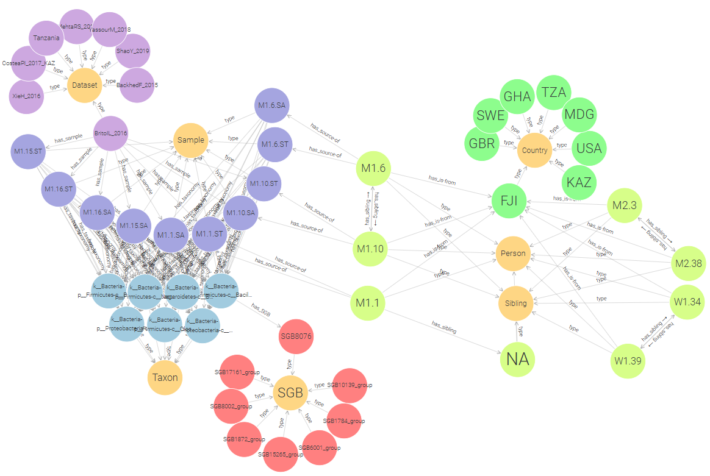

# KGE 2024/25 - The human microbiome and person-to-person interactions
This project was developed by *[Roan Spadazzi](roan.spadazzi@studenti.unitn.it)*, *[Vladyslav Husak](vladyslav.husak@studenti.unitn.it)*, *[Andrea Policano](andrea.policano@studenti.unitn.it)* for the Knowledge Graph Engineering course at the University of Trento. The provided iTelos methodology was the basis for the development of the project.

## Background
The microbiome plays a fundamental role in understanding human health and social interactions. This project focuses on systematically organizing data on microbiome transmission patterns, incorporating both biological and social dimensions. By leveraging the Knowledge Graph (KG) approach, we aim to provide researchers and clinicians with tools to explore the dynamics of microbial diversity and transmission across populations.

## Purpose
The primary goal of this project is to create a comprehensive and reusable system for exploring microbiome transmission data. The system must support:
- Analysis of bacterial species transmission across various relationships (e.g., parent-child, siblings).
- Comparison of microbial diversity in different social and environmental contexts (e.g., Westernized vs. non-Westernized populations).
- Association of phenotypic characteristics (e.g., motility, Gram-staining) with specific transmission patterns.

## Personas and Competency Questions (CQs)
The project identifies five distinct personas, each representing a different perspective and set of requirements for the Knowledge Graph:

1. **Francesca (Microbiologist)**: Focused on studying microbial transmission within family households and its connection to phenotypic features.
2. **Karmen (Clinician)**: Interested in analyzing geographic and environmental impacts on microbial transmission for better treatment planning.
3. **Franco (Student)**: Aims to understand and present the mechanisms of bacterial transmission.
4. **Juana (Dental Hygienist)**: Requires data on oral microbial transmission rates for teaching purposes.
5. **Herald (Social Scientist)**: Investigates how microbial transmission reflects social relationships and interactions.

Each persona has a set of specific competency questions (CQs) that the KG addresses. In addition, generalized questions applicable across multiple scenarios are included. Examples of such generalized questions are:
- What are the primary mechanisms of bacterial transmission between individuals?
- How do microbial transmission rates vary across different geographic regions?
- Which bacterial species are most commonly transmitted within specific social structures, such as families?

For a detailed breakdown of all competency questions by persona, refer to the full project report.

## ER Model

The Entity-Relationship (ER) model is designed to structure and represent the key entities and relationships in the Knowledge Graph. It is divided into three main categories:

1. **Common Entities**: These entities are general and reusable across various domains. Examples include:
   - **Country**: Represents the geographic origin of samples or individuals, including a `Boolean` attribute to indicate whether the country is Westernized.
   - **Person**: Includes key attributes such as `Subject_ID`, `Gender`, `Family_ID`, and relationships like `Mother`, `Father`, and `Sibling`.
   - **Sibling**: Further specialized into **Twin**, which captures attributes such as `Zygosity` and `Age_Living_Apart`.

2. **Core Entities**: These are central to the microbiome transmission analysis and directly linked to the project's objectives. Examples include:
   - **Sample**: The main hub for data, storing information like `Sample_ID`, `Body_Site`, and `Age_Category`.
   - **Taxonomy**: Defines the hierarchical classification of microbial species (e.g., Kingdom, Phylum, Genus, Species).
   - **SGB (Species-Level Genome Bins)**: Groups microbial genomes, serving as a link between `Samples` and microbial classification.

3. **Contextual Entities**: Purpose-specific entities that provide additional granularity and context. Examples include:
   - **Phenotype**: Captures microbial traits such as `Spore_Former`, `Anaerobe`, `Motile`, and `Gram_Negative`.
   - **Transmission**: Details microbial transmission rates in different contexts, including `Mother-Infant`, `Household`, and `Intradataset`.

## Key Relationships

- Each **Sample** is linked to a **Person** and associated with a **Country**, capturing demographic and geographic context. Samples are categorized by body site and contain **Taxons**, representing microbial classifications, and **Abundance** data, showing relative microbial diversity.  

- **SGBs (Species-Level Genome Bins)** connect Taxons to phenotypic traits, such as motility and spore formation, and to **Transmission** metrics, including mother-infant and household transmission rates.  

- **Person** is linked to **Sibling**, which has connection **Twin** entity.

*The Entity-Relationship (ER) model with entities categorized into Common, Core, and Contextual groups.*

## Data Employed

The project utilized several datasets to construct a robust Knowledge Graph, focusing on microbiome transmission dynamics. Below is a description of the key datasets employed:

1. **Primary Microbiome Transmission Study**:  
   - **Source**: [Valles-Colomer, M., Blanco-Míguez, A., Manghi, P. et al. The person-to-person transmission landscape of the gut and oral microbiomes. *Nature* 614, 125–135 (2023)](https://doi.org/10.1038/s41586-022-05620-1).  
   - **Description**: This study explores the human microbiome's transmission across populations and social contexts. It provides a rich dataset, including microbial taxonomy, transmission rates, phenotypes, and statistical analyses derived from metagenomic samples. Supplementary tables from this study served as the foundation for much of the project.

2. **Sample Metadata**:  
   - **Source**: Supplementary Tables S1 and S2 from the primary study.  
   - **Description**: Contains metadata for 9,700 samples, including demographic details (e.g., age, gender, and relationships), body sites (e.g., saliva, stool), and links between individuals and their samples.  
   - **Purpose**: Enables analysis of microbial transmission patterns by linking samples to individuals and family units.

3. **Taxonomy Data**:  
   - **Source**: Tables S4 and S5 from the primary study.  
   - **Description**: Provides detailed taxonomic classifications (e.g., Kingdom, Genus, Species) for bacterial species found in stool and saliva samples.  
   - **Purpose**: Supports identification of microbial species and their relative abundance in samples.

4. **Transmission Rates**:  
   - **Source**: Tables S9, S16, S20, and S30-S32 from the primary study.  
   - **Description**: Includes transmission metrics such as mother-infant transmission, household transmission rates, and inter-dataset transmission rates.  
   - **Purpose**: Captures key dynamics of microbial sharing across different social and environmental contexts.

5. **Phenotypic Data**:  
   - **Source**: Table S34 from the primary study.  
   - **Description**: Contains microbial traits like `Spore_Former`, `Motility`, `Anaerobic Status`, and `Gram_Negative` characteristics.  
   - **Purpose**: Enables linking microbial phenotypes to transmission and environmental factors.

7. **Curated Metagenomic Data (R Library)**:  
   - **Source**: [curatedMetagenomicData R package](https://bioconductor.org/packages/release/data/experiment/html/curatedMetagenomicData.html).  
   - **Description**: The curatedMetagenomicData package provides standardized, curated human microbiome data for novel analyses. It includes gene families, marker abundance, marker presence, pathway abundance, pathway coverage, and relative abundance for samples collected from different body sites. The bacterial, fungal, and archaeal taxonomic abundances for each sample were calculated with MetaPhlAn3, and metabolic functional potential was calculated with HUMAnN3. The manually curated sample metadata and standardized metagenomic data are available as (Tree)SummarizedExperiment objects.  
   - **Purpose**: Adds the ralative abundance data to the KG adding quantitative analysis options.

8. **Abundance Data**:  
   - **Source**: Derived from curatedMetagenomicData R package.  
   - **Description**: Provides relative abundance values for microbial species across all samples, linking each species to its presence in individual samples.  
   - **Purpose**: Facilitates quantitative analysis of microbial diversity and distribution.

## Teleontology

The teleontology developed for this project integrates and extends existing ontologies to align with the specific goals of the Knowledge Graph. The following ontologies were used:

1. **Schema.org**:
   - Provides a general framework for describing entities and their relationships.
   - Used to define high-level concepts such as `Dataset`, `Country`, and `Person`.

2. **Bioschemas.org**:
   - Specializes in life sciences and extends Schema.org with profiles for biological data.
   - Used to model domain-specific entities such as `BioSample` and `Taxon`.

3. **Custom Extensions**:
   - To address the microbiome-specific requirements, we defined custom entities and properties (e.g., `Transmission`, `Phenotype`) that were not covered by existing ontologies.

### Merging and Modifications
The integration involved:
- **Alignment**: Entities and properties from Schema.org and Bioschemas.org were aligned with the Entity-Relationship model.
- **Customization**: New purpose-specific entities (e.g., `SGB`, `Twin`) and relationships were added to represent microbiome data.
- **Simplification**: Redundant properties and entities from the base ontologies were removed to streamline the teleontology.
- **Formalization**: The final teleontology was implemented in OWL using Protégé, ensuring it was consistent, reusable, and compatible with the data structure.

This merged and modified teleontology forms the backbone of the Knowledge Graph, enabling structured queries and facilitating the integration of diverse data sources.

## Knowledge Graph

The Knowledge Graph (KG) developed for this project integrates data on microbiome samples, social relationships, and environmental factors. It represents a comprehensive dataset, enabling advanced queries and exploration of microbial dynamics. Below are the key statistics that highlight the scale and scope of the graph:

1. **Entity and Relationship Statistics**:
   - Total entities: Over 1.7 million
   - Total relationships (statements): More than 5.3 million
   - Major entities include:
     - Samples: Nearly 6,000 instances
     - Taxons: Over 1,600 instances
     - SGBs (Species-Level Genome Bins): Approximately 900 instances
     - People: Over 3,000 instances
   - Each entity is connected by an average of 6 relationships, ensuring a highly interconnected graph.

2. **Data Distribution**:
   - Most connections involve microbiome data such as relative abundance, taxonomic classifications, and phenotypes.
   - Significant relationships exist between individuals and their microbiome samples, linking geographic and social contexts.

3. **Connectivity**:
   - The KG is highly interconnected, with entities like samples and taxons serving as central hubs for microbiome data.
   - Relationships also capture interactions between people, microbial transmission, and environmental factors, providing a detailed view of microbiome dynamics.

  
*Graph made with GraphDB showing the connections between entities of the KG. Notice the BritoIL_2016 Dataset (purple) containing Samples (blue) taken from People (light green) with sibling relationships, from Fiji (Country, green). Moreover, Samples contain Taxons (light blue) that correspond to an SGB or a group of them (red).*

## Evaluation

The evaluation of the Knowledge Graph (KG) focused on assessing its ability to address competency questions and its overall quality. Below are the key results:

1. **Coverage**:
   - The KG successfully incorporated all key entities, relationships, and properties defined in the teleontology.
   - It was able to answer most of competency questions. However, not all of them can be directly answered with the result of a query. In such cases the result of the query is a strong starting point for more research to follow.

2. **Performance**:
   - The KG exhibited strong query performance despite its large scale, containing over 1.7 million entities and 5.3 million relationships.

## Materials

- [GitHub Repository](#)  
- [Final Project Report](#)  
- [Metadata Files](#)  
- [Language Definition Sheet](#)  

